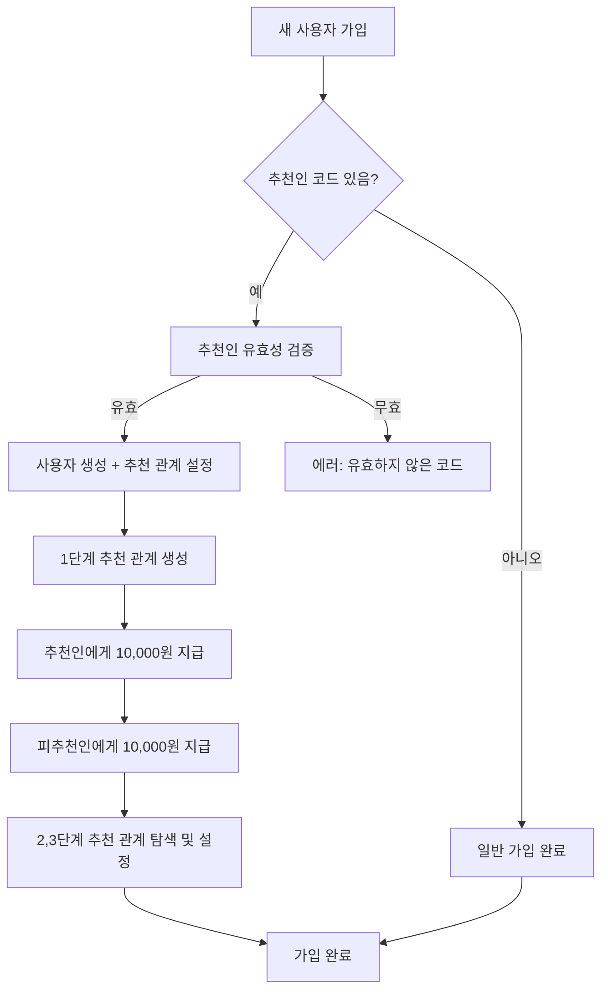
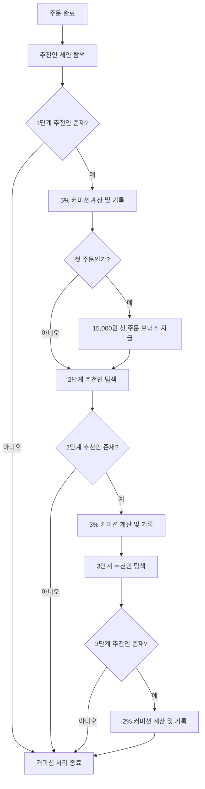

# 🚀 INSTAUP 추천인 시스템 알고리즘 (SNS Shop 모델)

## 📊 시스템 개요

이 추천인 시스템은 한국의 실제 SNS 성장 플랫폼인 snsshop.kr의 추천인 모델을 분석하여 구현된 **3단계 다단계 커미션 시스템**입니다.

### 🎯 핵심 특징
- **3단계 추천 구조**: 직접 추천(1단계) + 간접 추천(2단계, 3단계)
- **즉시 보상**: 가입 시 양쪽 모두 10,000원 즉시 지급
- **평생 커미션**: 추천받은 사용자의 모든 주문에서 커미션 발생
- **자동 처리**: 모든 보상과 커미션이 자동으로 계산 및 지급

---

## 💰 보상 구조

### 1. 가입 보상 (Signup Bonus)
```
추천인 → 10,000원 즉시 지급
피추천인 → 10,000원 즉시 지급
총 지급액: 20,000원
```

### 2. 첫 주문 보너스 (First Order Bonus)
```
추천인 → 15,000원 추가 지급 (피추천인의 첫 주문 완료 시)
조건: 1단계 직접 추천만 해당
```

### 3. 주문 커미션 (Order Commission)
```
1단계 (직접 추천): 주문 금액의 5%
2단계 (간접 추천): 주문 금액의 3%
3단계 (3차 추천): 주문 금액의 2%
```

---

## 🔄 알고리즘 흐름도

### 회원가입 프로세스


### 주문 완료 시 커미션 처리


---

## 🛠 데이터베이스 구조

### User 테이블
```sql
- id: 사용자 고유 ID
- referralCode: 나만의 추천인 코드 (예: INSTA123456)
- referredBy: 나를 추천한 사용자 ID
- balance: 현재 잔액
```

### Referral 테이블 (추천 관계)
```sql
- referrerId: 추천인 ID
- referredId: 피추천인 ID
- level: 추천 단계 (1=직접, 2=2단계, 3=3단계)
- status: 상태 (PENDING, ACTIVE, INACTIVE, BLOCKED)
- signupReward: 가입 보상 금액 (10,000원)
- firstOrderBonus: 첫 주문 보너스 (15,000원)
- commissionRate: 커미션율 (0.05, 0.03, 0.02)
```

### ReferralCommission 테이블 (커미션 기록)
```sql
- referralId: 추천 관계 ID
- orderId: 해당 주문 ID
- amount: 커미션 금액
- rate: 적용된 커미션율
- type: 커미션 타입 (SIGNUP_BONUS, FIRST_ORDER_BONUS, ORDER_COMMISSION, etc.)
- status: 지급 상태 (PENDING, PAID, CANCELLED)
```

---

## 📈 커미션 계산 알고리즘

### 1. 기본 커미션 계산
```typescript
function calculateCommission(orderAmount: number, level: number): number {
  const rates = {
    1: 0.05,  // 1단계: 5%
    2: 0.03,  // 2단계: 3%
    3: 0.02   // 3단계: 2%
  }

  return Math.floor(orderAmount * (rates[level] || 0))
}
```

### 2. 다단계 추천인 탐색
```typescript
async function findReferralChain(userId: string) {
  const chain = []
  let currentUserId = userId

  for (let level = 1; level <= 3; level++) {
    const referral = await findReferrer(currentUserId)
    if (!referral) break

    chain.push({ level, referrerId: referral.referrerId })
    currentUserId = referral.referrerId
  }

  return chain
}
```

### 3. 주문 완료 시 커미션 처리
```typescript
async function processOrderCommissions(orderId: string) {
  const order = await getOrder(orderId)
  const referralChain = await findReferralChain(order.userId)

  for (const { level, referrerId } of referralChain) {
    const commissionAmount = calculateCommission(order.finalPrice, level)

    if (commissionAmount > 0) {
      await createCommission({
        referralId: getReferralId(referrerId, order.userId),
        orderId: order.id,
        amount: commissionAmount,
        rate: getCommissionRate(level),
        type: getCommissionType(level)
      })
    }
  }
}
```

---

## 🎮 실제 예시 시나리오

### 시나리오: A → B → C 추천 체인

1. **A가 B를 추천**
   - B 가입 시: A +10,000원, B +10,000원
   - B 첫 주문(100,000원) 시: A +15,000원 (첫 주문 보너스) + 5,000원 (5% 커미션)

2. **B가 C를 추천**
   - C 가입 시: B +10,000원, C +10,000원
   - C 첫 주문(50,000원) 시:
     - B +15,000원 (첫 주문 보너스) + 2,500원 (5% 커미션)
     - A +1,500원 (3% 2단계 커미션)

3. **C의 추가 주문(30,000원)**
   - B +1,500원 (5% 1단계 커미션)
   - A +900원 (3% 2단계 커미션)

---

## 🔒 보안 및 검증

### 1. 추천인 코드 생성
```typescript
function generateUniqueReferralCode(): string {
  const chars = 'ABCDEFGHJKLMNPQRSTUVWXYZ23456789'
  let result = 'INSTA'
  for (let i = 0; i < 6; i++) {
    result += chars.charAt(Math.floor(Math.random() * chars.length))
  }
  return result // 예: INSTA3H7K9M
}
```

### 2. 순환 참조 방지
```typescript
function validateReferralCode(newUserId: string, referralCode: string): boolean {
  // 자기 자신의 코드 입력 방지
  // 순환 참조 방지 (A→B→A)
  // 최대 추천 깊이 제한 (3단계)
  return isValidReferral
}
```

### 3. 중복 보상 방지
```typescript
// 트랜잭션을 통한 원자성 보장
await prisma.$transaction(async (tx) => {
  // 사용자 생성
  // 추천 관계 설정
  // 보상 지급
  // 커미션 기록
})
```

---

## 📊 통계 및 분석

### ReferralStats 테이블
```sql
- directReferrals: 직접 추천 수
- level2Referrals: 2단계 추천 수
- level3Referrals: 3단계 추천 수
- totalCommission: 총 커미션
- thisMonthCommission: 이번 달 커미션
- pendingCommission: 대기 중인 커미션
- conversionRate: 추천 전환율
```

### 실시간 업데이트
```typescript
// 주문 완료 시 통계 자동 업데이트
async function updateReferralStats(userId: string) {
  // 직접 추천 수 계산
  // 커미션 합계 계산
  // 전환율 계산
  // 캐시 테이블 업데이트
}
```

---

## 🎯 성과 지표

### 사용자 참여도
- 추천 활성화율: 전체 사용자 중 추천 코드 사용률
- 추천인당 평균 피추천인 수
- 피추천인 첫 주문 전환율

### 수익성
- 추천으로 인한 신규 사용자 획득 비용
- 추천 사용자 vs 일반 사용자 LTV 비교
- 커미션 지급 대비 추가 매출 비율

### 시스템 안정성
- 커미션 계산 정확도
- 지급 처리 지연율
- 사기/어뷰징 탐지율

---

## 🚀 향후 확장 계획

1. **인플루언서 프로그램**
   - 특별 추천인 등급 (브론즈, 실버, 골드)
   - 등급별 차등 커미션율

2. **팀 빌딩 시스템**
   - 팀 성과에 따른 보너스
   - 팀 리더 추가 보상

3. **AI 기반 추천 최적화**
   - 사용자 성향 분석
   - 개인화된 추천 전략

4. **블록체인 기반 투명성**
   - 커미션 지급 내역 공개
   - 스마트 컨트랙트 자동 실행

---

이 시스템은 한국의 성공적인 SNS 성장 플랫폼인 snsshop.kr의 추천인 모델을 벤치마킹하여, 사용자 참여도와 수익성을 동시에 극대화하는 **3단계 다단계 커미션 구조**를 구현했습니다.
